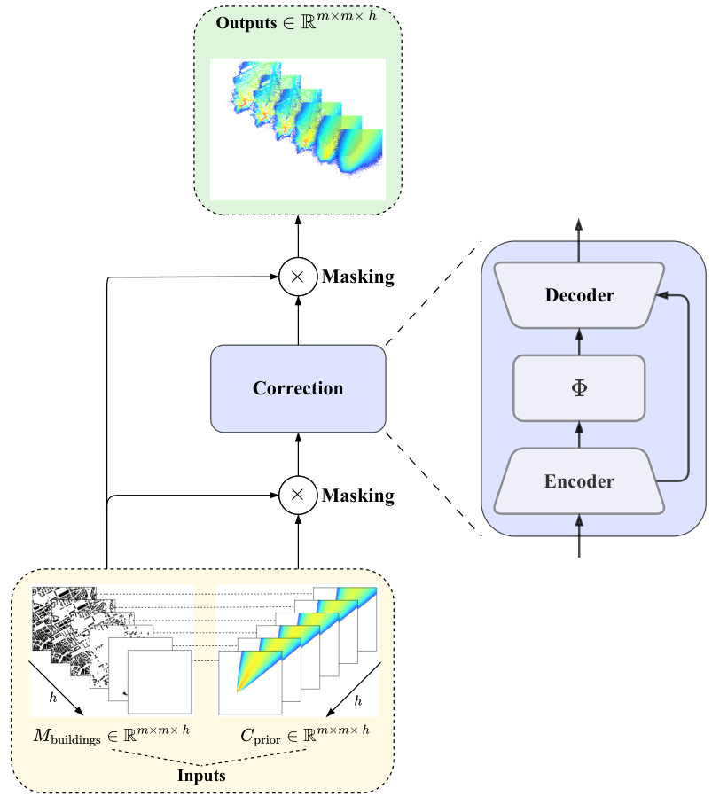

<div align="center">
<h1>A 3D Discrepancy Modeling Framework for Urban Air Pollution Prediction</h1>
</div>

<!-- Badges -->
<p align="center">
  <a href="https://zenodo.org/records/15187091"> 
    
  </a>
  <a href="LICENSE">
    
  </a>
  <a href="https://www.sciencedirect.com/journal/environmental-modelling-and-software">
    
  </a>
</p>


## 🧠 Overview

The MCxM-3D framework extends the original [MCxM-2D approach](https://cea.hal.science/cea-04176975/document) to 3D spatial domains for improved modeling of pollutant dispersion in urban environments. It leverages state-of-the-art machine learning models, including neural operators, to predict 3D concentration fields, trained on synthetic data generated by the PMSS atmospheric dispersion simulator.

<div align="center">

</div>

## 🚧 Code coming soon!  
This repository will host the official implementation of the **MCxM-3D** framework described in the paper: *A 3D Discrepancy Modeling Framework for Urban Pollution Prediction in Accelerated Time* (Submitted to *Environmental Modelling & Software*).

The full code and documentation will be uploaded shortly.

## 📂 Related Dataset

The dataset used in this work is publicly available on Zenodo: [**High-Resolution Dataset of Time-Integrated 3D Urban Pollutant Concentration Fields**](https://zenodo.org/records/15187091).  


## 📢 Citation

If you find this work useful, please cite both the **papers** and the **dataset**.

### Paper Citation

```bibtex
@article{mendil20253d,
  title={A 3D discrepancy modeling framework for urban pollution prediction in accelerated time},
  author={Mendil, Mouhcine and Leirens, Sylvain and Novello, Paul and Duchenne, Christophe and Armand, Patrick},
  journal={Environmental Modelling \& Software},
  pages={106662},
  year={2025},
  publisher={Elsevier}
}
```

### Dataset Citation
```bibtex
@misc{armand2025high,
  author       = {Armand, P. and Duchenne, C. and Leirens, S. and Mendil, M.},
  title        = {High-Resolution Dataset of Time-Integrated 3D Urban Pollutant Concentration Fields},
  year         = {2025},
  publisher    = {Zenodo},
  doi          = {10.5281/zenodo.15187091},
  url          = {https://doi.org/10.5281/zenodo.15187091},
  note         = {Data set}
}
```

### 📄 Previous Work (MCxM-2D Article)
```bibtex
@article{mendil2022hazardous,
  title={Hazardous atmospheric dispersion in urban areas: A Deep Learning approach for emergency pollution forecast},
  author={Mendil, Mouhcine and Leirens, Sylvain and Armand, Patrick and Duchenne, Christophe},
  journal={Environmental Modelling \& Software},
  volume={152},
  pages={105387},
  year={2022},
  publisher={Elsevier}
}
```
---

